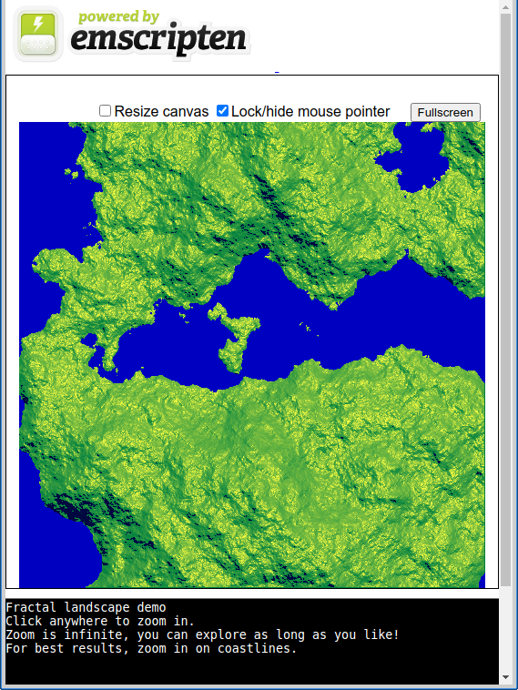

# sdlfracland
This is a simple fractal landscape demo, written in C++ and SDL2.



[Click here to try it out!](https://lmillerchip.github.io/sdlfracland/)

The program generates an infinite fractal landscape. You can keep zooming in forever and it will generate land as you go. Simply click on an interesting piece of coastline and it will zoom in where you clicked.

It works best when you zoom in on coastlines, as these are rich in detail and easy to see. If you keep zooming in on water or land you will eventually exhaust the numeric precision of the machine and interesting breakage will happen. This doesn't happen on coastlines as the height always stays around zero.

## Compiling
The program compiles for both Linux and the web. The web version uses Emscripten to compile to WASM.
Building has been tested on Ubuntu Linux 18.04 but other versions of Linux should work. To build for the web:

```bash
make clean; make
```

This requires the latest stable emscripten using emsdk: [Link here](https://github.com/emscripten-core/emsdk)

To build for Linux, you need G++, GNU make and libSDL2 installed, then type:

```bash
make clean; make linux
```

